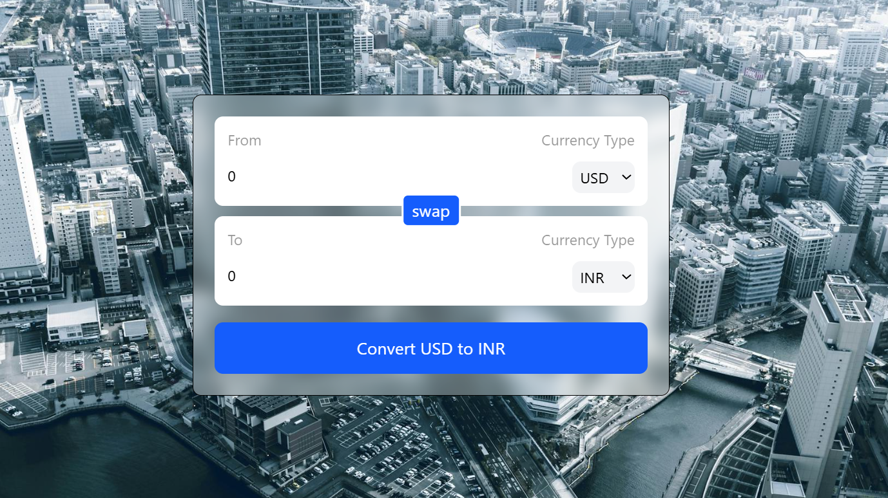

# 💱 Currency Converter App

A simple and elegant currency converter built with **React + Vite**.  
It uses the **[FreeCurrencyAPI](https://freecurrencyapi.com/)** to fetch real-time exchange rates.

---

## 🚀 Features

- 🔄 Convert between any two global currencies.
- 🔃 Swap currencies with one click.
- 🌍 Real-time exchange rates from FreeCurrencyAPI.
- 🎨 Modern responsive UI (Tailwind CSS).
- 🪝 Custom hook `useCurrencyInfo` for fetching rates.

---

## 📸 Screenshot

> 

---

## 🛠️ Tech Stack

- **React + Vite** ⚛️
- **Tailwind CSS** 🎨
- **FreeCurrencyAPI** 🌍
- **Custom Hooks** (for API calls)

---

## 📂 Project Structure

```
src/
 ┣ components/
 ┃ ┗ InputBox.jsx
 ┣ hooks/
 ┃ ┗ useCurrencyInfo.js
 ┣ App.jsx
 ┗ main.jsx
```

---

## ⚡ Getting Started

### 1️⃣ Clone the repo
```bash
git clone https://github.com/your-username/currency-converter.git
cd currency-converter
```

### 2️⃣ Install dependencies
```bash
npm install
```

### 3️⃣ Set up environment variables
Create a `.env` file in the project root:

```env
VITE_CURRENCY_API_KEY=your_api_key_here
```

> 🔑 Get your free API key from [FreeCurrencyAPI](https://freecurrencyapi.com/).

### 4️⃣ Start the app
```bash
npm run dev
```

App runs at: **http://localhost:5173**

---

## 📖 Usage

1. Select the **From currency** and enter an amount.
2. Select the **To currency**.
3. Click **Convert** to get the converted value.
4. Use the **Swap** button to switch currencies quickly.

---

## 🧩 Example Code Snippet

### `useCurrencyInfo.js`

```js
import { useEffect, useState } from "react";

function useCurrencyInfo(currency) {
  const [data, setData] = useState({});

  useEffect(() => {
    fetch(
      `https://api.freecurrencyapi.com/v1/latest?apikey=${import.meta.env.VITE_CURRENCY_API_KEY}&base_currency=${currency}`
    )
      .then((res) => res.json())
      .then((res) => setData(res.data))
      .catch((err) => console.error("API Error:", err));
  }, [currency]);

  return data;
}

export default useCurrencyInfo;
```

---

## ✅ To-Do / Improvements

- [ ] Add historical exchange rates chart.
- [ ] Add multi-language support.
- [ ] Add dark mode theme.
- [ ] Cache rates for offline use.

---

## 📜 License

This project is licensed under the **MIT License**.

---

👨‍💻 Developed by *[sumit gautam]* 🚀
